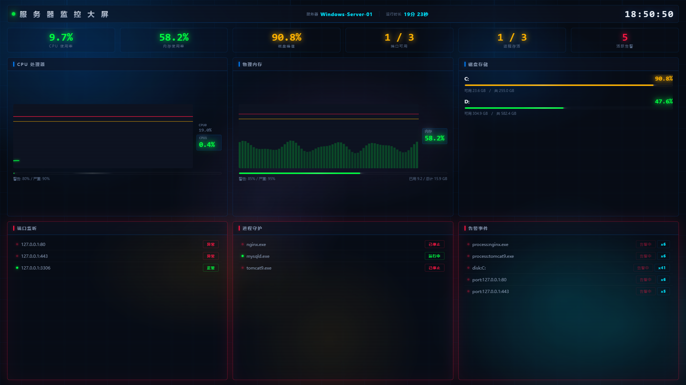

# 服务器综合监控系统

实时监控 Windows 服务器的 CPU、内存、磁盘、端口和进程状态，支持智能阈值告警和多平台 Webhook 推送。

## 功能特性

- **监控大屏**：深色科技风 Web 仪表盘，实时趋势图 + 波浪占比图 + 状态面板
- **系统资源监控**：CPU 趋势折线、内存波浪图、磁盘使用率，支持排除指定盘符
- **多 CPU 支持**：自动识别多路服务器，双行切换显示每个物理 CPU 的使用率
- **智能阈值告警**：多级告警（警告/严重）、连续计数防误报、冷却机制、恢复通知
- **告警静默时段**：可配置夜间静默，仅静默警告级别，严重告警不受影响
- **端口监控**：TCP 端口连通性检测，支持 IPv4/IPv6，状态变化闪烁提示
- **进程监控**：Windows 进程存活检测（大小写不敏感），状态变化闪烁提示
- **Webhook 推送**：支持飞书、企业微信、钉钉等多平台，自动适配消息格式
- **邮件通知**：SMTP 邮件告警，支持 QQ/163/Gmail/企业邮箱
- **配置热重载**：修改配置文件后自动生效，无需重启
- **双模式运行**：控制台前台运行 + Windows 服务后台运行
- **日志轮转**：自动按大小轮转日志文件，保留历史记录
- **数据导出**：CSV 格式导出历史监控数据
- **心跳检测**：定时记录程序自身运行状态和资源占用

## 环境要求

| 依赖 | 说明 |
|------|------|
| 操作系统 | Windows / Linux |
| Python | 3.8+ |
| pip | 20.0+ |

> Linux 下修改 `config.yaml` 中磁盘盘符为挂载点路径（如 `/`、`/home`），进程名去掉 `.exe` 后缀即可正常使用。

## 快速开始

### 1. 安装依赖

```bash
pip install -r requirements.txt
```

### 2. 修改配置

编辑 `config/config.yaml`，根据实际环境修改监控目标和 Webhook 地址。

### 3. 启动程序

**Windows：**
```bash
双击 start.bat
```

**Linux：**
```bash
chmod +x start.sh stop.sh
./start.sh                    # 前台运行
nohup ./start.sh &            # 后台运行
./stop.sh                     # 停止后台进程
```

**命令行（Windows / Linux 通用）：**
```bash
python main.py                # 前台运行
python main.py --debug        # 调试模式
python main.py -c my.yaml     # 指定配置文件
```

> Linux 使用前需修改 `config.yaml`：磁盘 `exclude` 改为挂载点（如 `/mnt/cdrom`），进程名去掉 `.exe` 后缀。

### 4. 打开监控大屏

浏览器访问 `http://127.0.0.1:5000`，建议 F11 全屏查看。



大屏每 5 秒自动刷新，包含：

- **摘要条**：CPU/内存/磁盘峰值/端口/进程/告警 六项关键指标
- **CPU 卡片**：趋势折线图 + 当前 CPU 使用率（多路服务器自动轮播切换）
- **内存卡片**：波浪占比图 + 使用量 / 总量
- **磁盘卡片**：各盘符进度条
- **端口卡片**：连通状态列表，异常时蓝色闪烁
- **进程卡片**：运行状态列表，变化时蓝色闪烁
- **告警卡片**：活跃告警追踪

支持 CSV 导出：访问 `/api/export?minutes=60` 下载最近 60 分钟数据。
```

### 4. 安装为 Windows 服务

以**管理员权限**运行 `install_service.bat`，或手动执行：

```bash
# 安装服务
python main.py -s install

# 启动服务
python main.py -s start

# 停止服务
python main.py -s stop

# 卸载服务
python main.py -s remove
```

卸载服务：以**管理员权限**运行 `uninstall_service.bat`

## 配置说明

### 服务器基本信息

```yaml
server:
  name: "Server-01"          # 服务器标识，会出现在告警消息中
```

### 系统资源监控

```yaml
system_monitor:
  interval: 5                # 采集间隔（秒），范围 1-60
  cpu:
    warning_threshold: 80    # 警告阈值（%）
    critical_threshold: 90   # 严重阈值（%）
    consecutive_count: 3     # 连续超过阈值次数才触发告警
    cooldown: 300            # 冷却时间（秒），同指标在此时间内不重复告警
  memory:
    warning_threshold: 85
    critical_threshold: 95
    consecutive_count: 3
    cooldown: 300
  disk:
    warning_threshold: 90
    critical_threshold: 95
    consecutive_count: 3
    cooldown: 300
    exclude: ["A:", "B:"]    # 排除的磁盘盘符
```

### 端口监控

```yaml
port_monitor:
  interval: 30               # 检测间隔（秒）
  timeout: 5                 # 连接超时（秒）
  consecutive_count: 2       # 连续不可达次数
  cooldown: 300
  ports:
    - "127.0.0.1:80"         # IPv4 格式
    - "127.0.0.1:443"
    - "[::1]:8080"           # IPv6 格式
```

### 进程监控

```yaml
process_monitor:
  interval: 30
  consecutive_count: 2
  cooldown: 300
  processes:
    - "nginx.exe"            # Windows 进程名（大小写不敏感）
    - "mysqld.exe"
```

### Webhook 配置

```yaml
webhook:
  urls:                      # Webhook 地址列表，同时推送到多个平台
    - "https://open.feishu.cn/open-apis/bot/v2/hook/your-key"  # 飞书
    - "https://qyapi.weixin.qq.com/cgi-bin/webhook/send?key=your-key"  # 企业微信
  timeout: 10                # 请求超时（秒）
  retry_count: 3             # 失败重试次数
  retry_interval: 5          # 重试间隔（秒）
```

### Web 管理界面

```yaml
web_dashboard:
  enabled: true               # 是否启用 Web 界面
  host: "0.0.0.0"             # 监听地址，127.0.0.1 仅本机访问
  port: 5000                  # 监听端口
```

### 邮件通知

```yaml
email:
  enabled: false              # 是否启用邮件通知
  smtp_server: "smtp.qq.com"  # SMTP 服务器
  smtp_port: 465              # SSL 端口 465，STARTTLS 端口 587
  use_ssl: true               # true=SSL直连, false=STARTTLS
  sender_email: "your@qq.com" # 发件人邮箱
  sender_password: "授权码"   # 邮箱授权码，非登录密码
  receiver_emails:            # 收件人列表
    - "admin@example.com"
```

### 心跳检测

```yaml
heartbeat:
  interval: 60                # 心跳间隔（秒），范围 30-600
  webhook_enabled: false      # 是否推送心跳到 Webhook
```

### 告警静默时段

```yaml
alert_silence:
  enabled: false              # 是否启用静默
  periods:
    - start: "22:00"          # 开始时间（HH:MM）
      end: "06:00"            # 结束时间（跨天自动处理）
      level: "warning"        # warning=仅静默警告, all=静默全部
```

### 数据存储

```yaml
metrics_store:
  max_records: 1000           # 内存最大记录数，范围 100-10000
```

### 日志配置

```yaml
logging:
  level: "INFO"              # DEBUG/INFO/WARNING/ERROR
  file: "logs/monitor.log"   # 日志文件路径
  max_size: 10               # 单个日志文件最大大小（MB）
  backup_count: 5            # 保留的历史日志文件数量
```

## 告警机制说明

### 告警触发流程

1. 监控线程检测到指标超过阈值 → 向告警队列发送事件
2. 告警管理器收到事件后累加计数器
3. 连续 N 次（`consecutive_count`）超过阈值 → 触发告警并通过 Webhook 推送
4. 进入冷却期（`cooldown` 秒），同指标不再重复告警
5. 指标恢复正常后，冷却期过后发送恢复通知

### 告警等级

| 等级 | 说明 | 图标 |
|------|------|------|
| warning | 超过警告阈值 | ⚠️ |
| critical | 超过严重阈值 | 🚨 |
| recovery | 指标恢复正常 | ✅ |

## 项目结构

```
windows-server-monitor/
├── config/
│   └── config.yaml          # 配置文件
├── logs/                    # 日志目录（自动创建）
├── src/
│   ├── __init__.py
│   ├── config_manager.py    # 配置加载与热重载
│   ├── system_monitor.py    # 系统资源监控
│   ├── port_monitor.py      # 端口监控
│   ├── process_monitor.py   # 进程监控
│   ├── alert_manager.py     # 告警管理器
│   ├── webhook_sender.py    # Webhook 发送器
│   └── logger_setup.py      # 日志配置
├── main.py                  # 主程序入口
├── install_service.bat      # 服务安装脚本
├── uninstall_service.bat    # 服务卸载脚本
├── start.bat                # 快速启动脚本
├── requirements.txt         # 依赖包列表
└── README.md                # 本文档
```

## 常见问题

### Q: 启动时提示 "No module named 'psutil'"

运行 `pip install -r requirements.txt` 安装依赖。

### Q: 提示 "pywin32 未安装"

pywin32 仅 Windows 服务模式需要。如果不需要服务模式，可忽略。
安装：`pip install pywin32`

### Q: 配置文件修改后未生效

程序每 10 秒检查一次配置文件是否变更，修改后等待最多 10 秒即可自动重载。

### Q: Webhook 推送失败

1. 检查 Webhook URL 是否正确
2. 检查服务器网络是否能访问对应的 Webhook 地址
3. 查看 `logs/monitor.log` 日志获取详细错误信息

### Q: 如何查看实时监控数据

前台运行时控制台每采集周期输出一次最新数据。后台服务模式下查看日志文件。

### Q: 程序 CPU/内存占用过高

正常情况下 CPU < 1%，内存 < 50MB。如果异常，检查：
- 采集间隔是否设置过小（建议 >= 5 秒）
- 端口监控超时是否过大
- `psutil.process_iter()` 在部分系统上较慢
